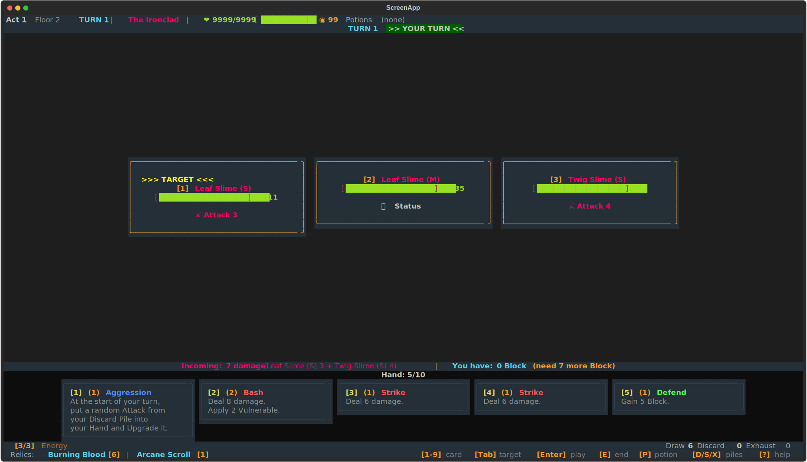
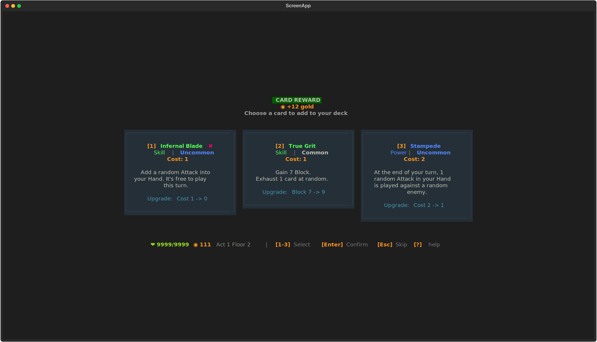
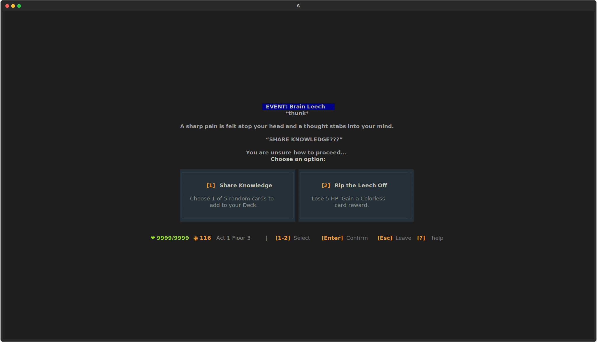

# sts2-tui

Play [Slay the Spire 2](https://store.steampowered.com/app/2868840/Slay_the_Spire_2/) in your terminal.

<p align="center">
  
</p>

A keyboard-driven TUI powered by [sts2-cli](https://github.com/keyunjie96/sts2-cli) (fork of [wuhao21/sts2-cli](https://github.com/wuhao21/sts2-cli)) — runs the real game engine headlessly, so all mechanics are identical to the actual game.

## Quick start

Requires Python 3.11+, [.NET 9 SDK](https://dotnet.microsoft.com/download), and Slay the Spire 2 on Steam.

```bash
git clone https://github.com/keyunjie96/sts2-tui.git
cd sts2-tui
./setup.sh
python -m sts2_tui.tui
```

Or bring your own sts2-cli:

```bash
export STS2_CLI_PATH=/path/to/sts2-cli
pip install -e .
python -m sts2_tui.tui
```

## Features

- All 5 characters: Ironclad, Silent, Defect, Regent, Necrobinder
- Full game: combat, map, shop, rest sites, events, card rewards
- Damage preview per target, incoming damage summary
- Deck viewer (D), relic viewer (R), pile viewers (D/S/X in combat)
- Chinese mode (`--lang zh`)
- Keyboard-only — no mouse needed

## Key bindings

**Combat:** `1-9` select card, `Tab` target, `Enter` play, `E` end turn, `P` potion

**Navigation:** `D` deck, `R` relics, `?` help, `Q` quit

**Map:** `1-9` pick path &nbsp; **Shop:** `1-9` buy, `L` leave &nbsp; **Reward:** `1-3` pick, `Esc` skip

## More screenshots

<details>
<summary>Card reward</summary>

</details>

<details>
<summary>Event</summary>

</details>

## How it works

```
sts2-tui (Python/Textual)  ←—JSON—→  sts2-cli (.NET)  ←—loads—→  sts2.dll (from Steam)
```

sts2-tui is a pure display layer. All game logic runs in sts2-cli, which loads the real game DLLs from your Steam install.

## License

MIT
